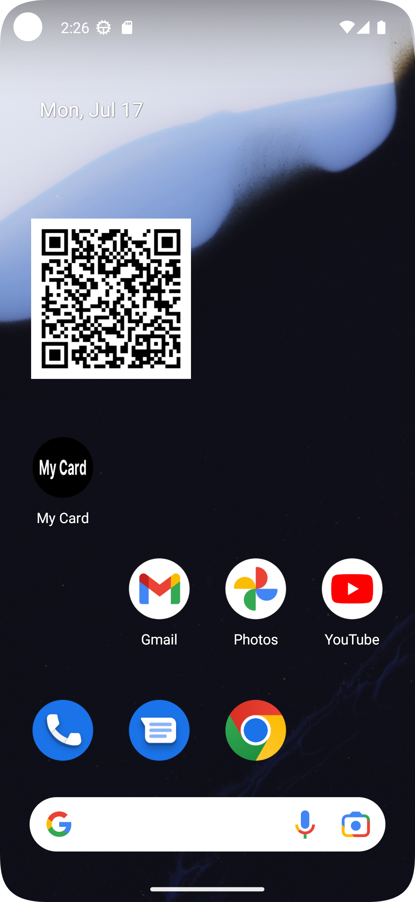
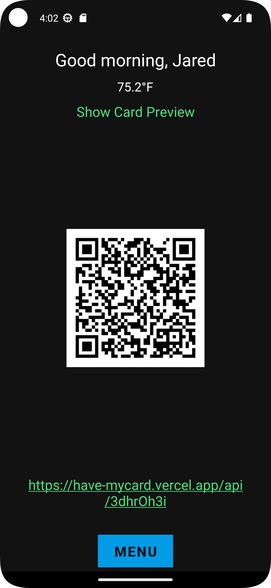
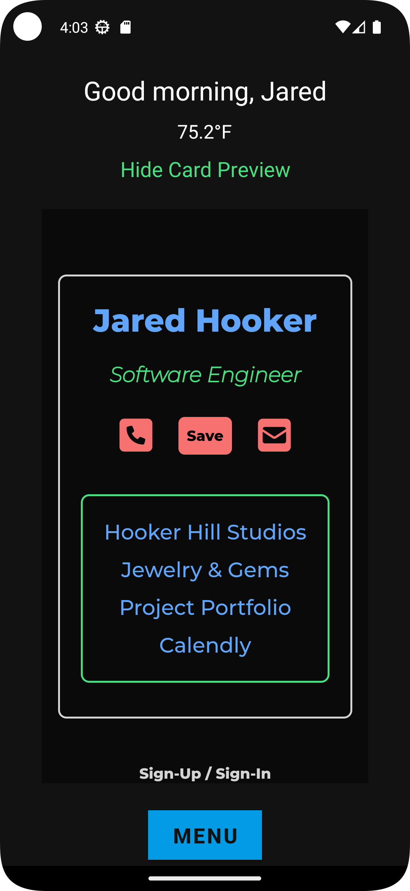
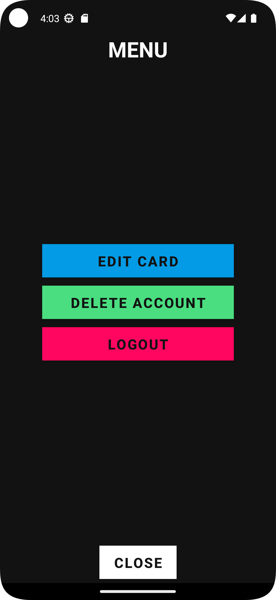
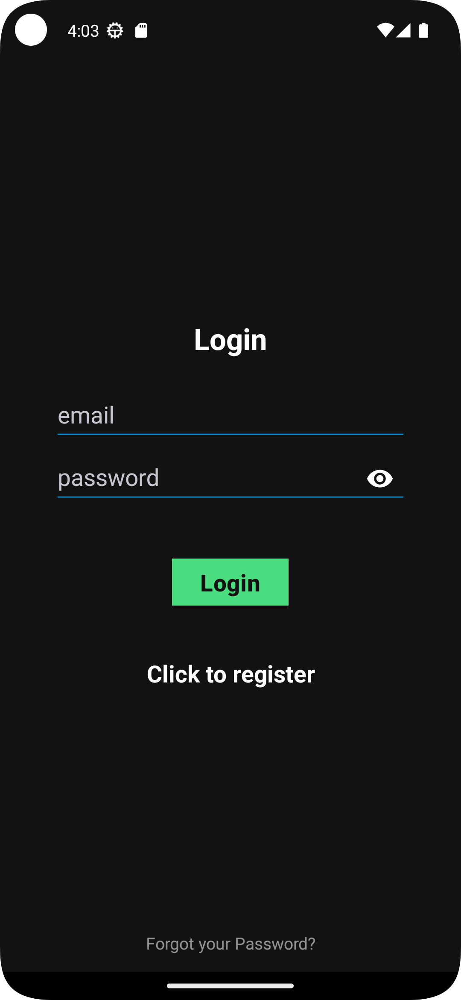
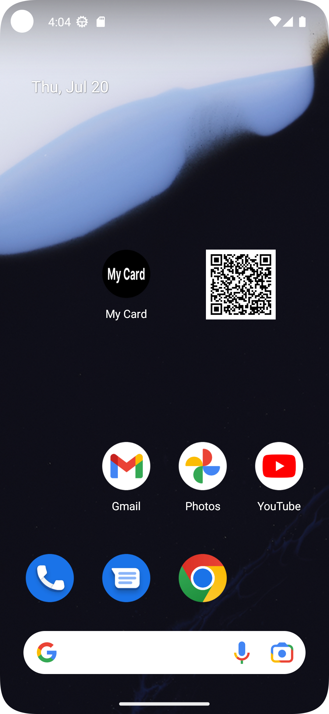

Created with Java and Android Studio

<a href="https://play.google.com/store/apps/details?id=mycard.mycard">View on Google Play</a>
<h1>About</h1>

My Card is a digital business card creator that allows the user to display their name, job/title, phone number, email address,
and 1-4 links on a digital card. The cards come pre designed with three unique themes, and are equipped with a 'save' button so that those you
share your card with can save all of your contact information with the touch of a button.

Each user is given a qr code and url that leads to their card, and the app feaures a home screen widget that displays the qr code 
on the phone's home screen for easy card sharing. 

<!-- Add the first row of images -->

  
  
  

  
  
  

